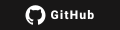
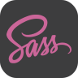
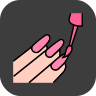

<table>
  <tr>
    <th style="width: 50%;">English</th>
    <th style="width: 50%;">Portuguese</th>
  </tr>
  <tr>
    <td>
Hello 👋
</td>
    <td>
Olá 👋
</td>
  </tr>
  <tr>
    <td>
My name is Lucas Jones, welcome to my GitHub profile!
</td>
    <td>
Me chamo Lucas Jones, bem-vindo ao meu perfil no GitHub!
</td>
  </tr>
  <tr>
    <td>
I am very happy with your visit. Please feel free to explore my work and contact me.
</td>
    <td>
Fico muito feliz com a sua visita. Sinta-se à vontade para explorar meu trabalho e entrar em contato comigo.
</td>
  </tr>
  <tr>
    <th colspan="2">
      
      
      
      
      
    </th>
  </tr>
  <tr>
    <td>
I'm a programming enthusiast. I've always had a technological tendency, but I've never worked in the area. In January 2024, I decided to invest in this passion, consistently dedicating myself to studying and developing programming skills.
</td>
    <td>
Sou um entusiasta de programação. Sempre tive uma tendência tecnológica, mas nunca trabalhei na área. Em janeiro de 2024, decidi investir nessa paixão, dedicando-me consistentemente ao estudo e desenvolvimento de habilidades em programação.
</td>
  </tr>
  <tr>
    <td>
It is difficult to find a vocation, but when we find it, we cannot ignore it.
</td>
    <td>
É difícil encontrar uma vocação, mas quando a encontramos, não podemos ignorá-la.
</td>
  </tr>
  <tr>
    <th style="width: 50%;">What will you find in this profile?</th>
    <th style="width: 50%;">O que você encontrará neste perfil?</th>
  </tr>
  <tr>
    <td>
Here, you will find a collection of projects related to the technologies I study, all well organized for easy access.
</td>
    <td>
Aqui, você encontrará uma coleção de projetos relacionados às tecnologias que estudo, todos bem organizados para fácil acesso.
</td>
  </tr>
  <tr>
    <th style="width: 50%;">Technologies I'm familiar with</th>
    <th style="width: 50%;">Tecnologias que estou familiarizado</th>
  </tr>
  <tr>
    <th colspan="2">
      
      
      
      
      
      
      
      
      
    </th>
  </tr>
  <tr>
    <th style="width: 50%;">Preferred tools</th>
    <th style="width: 50%;">Ferramentas preferidas</th>
  </tr>
  <tr>
    <th colspan="2">
      
      
      
      
      
    </th>
  </tr>
  <tr>
    <th style="width: 50%;">GitHub Stats</th>
    <th style="width: 50%;">Estatísticas do GitHub</th>
  </tr>
  <tr>
    <th colspan="2">
      
       
      
    </th>
  </tr>
</table>
